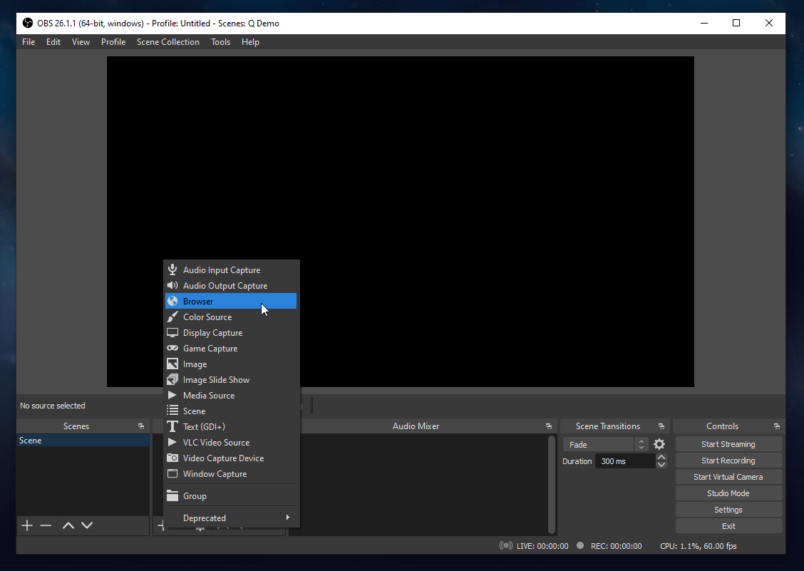
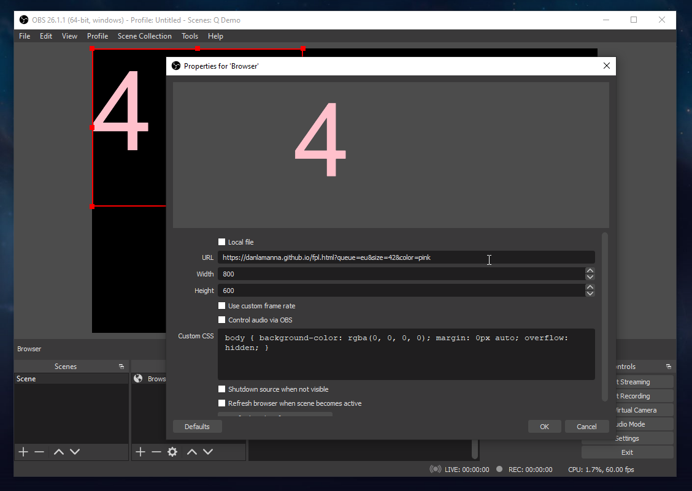

# Display FPL queue size in OBS

1) Add a browser source to your OBS sources   
   
   Use the following URLs:   
   NA:   
   ```
   https://danlamanna.github.io/fpl.html?queue=na
   ```

   EU:   
   ```
   https://danlamanna.github.io/fpl.html?queue=eu
   ```
   
2) Adjust size, reposition, etc   

3) Tweak text color/size by tweaking the URL, e.g.   
   
   NA:   
   ```
   https://danlamanna.github.io/fpl.html?queue=na&color=blue&size=40
   ```
    
   EU:   
   ```
   https://danlamanna.github.io/fpl.html?queue=eu&color=blue&size=40
   ```
